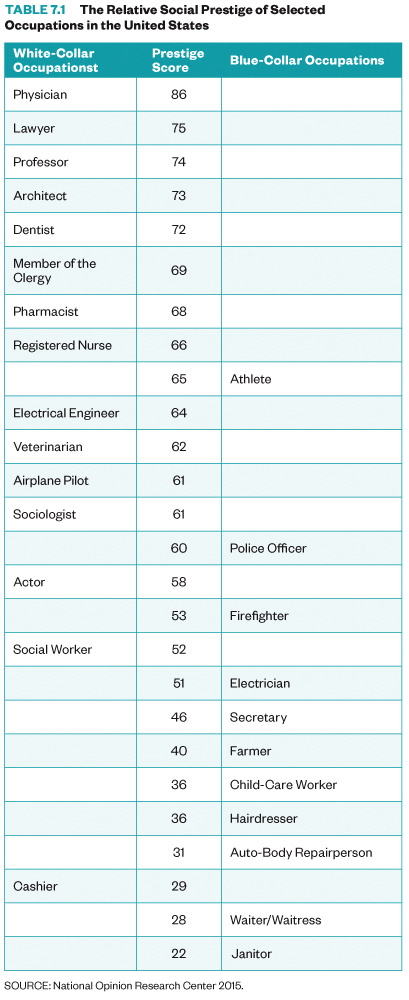

# Social class

In this lesson, we will examine the stratification phenomenon that occurs in all human societies, our own included. Despite rhetorical claims about equality of opportunity for all, America is a profoundly hierarchical society, with the benefits and rewards of living here unequally distributed among its people. A sociological perspective on stratification will increase your understanding in several essential ways. First, it will help you recognize inequities in places you may have overlooked, such as your own town, neighborhood, or school. Second, it will help you consider how social divisions and hierarchies of privilege and disadvantage appear across many of our institutions; access to health care, the justice system, employment, and housing are all governed by structures of inequality. Third, it should enable you to identify your place in these social arrangements and see how your position (or your family’s position) in certain hierarchies has shaped your life chances. Finally, a knowledge of stratification may help you play a role in changing systems of inequality.

## Learning Objectives

By the end of this lesson, you will be able to:
• Understand systems of social mobility and stratification.
• Describe social classes in the United States.
• Differentiate theoretical perspectives on social stratification.
• Apply appropriate research methods to understanding food insecurity.


## Deadlines

```{admonition} Be sure to hand these in before the deadline
* InQuizitive Chapter Set 7 (Thursday at 9:30am)
* SNAP Challenge application (Sunday at 11:55pm)
* American Factory reflection (Sunday at 11:55pm)

```

## Read
* '[Deviance](https://digital.wwnorton.com/87056/r/goto/cfi/92!/4)', Chapter 6 in Real World


## Watch
* [Class Lecture](https://unc.zoom.us/j/96531859232) Live on Tuesday at 9:45am.
[](https://unc.zoom.us/j/96531859232)

* [Deviance](https://www.youtube.com/watch?v=BGq9zW9w3Fw)


<iframe
    width="400"
    height="300"
    src="https://www.youtube.com/embed/BGq9zW9w3Fw"
    frameborder="0"
    allowfullscreen
></iframe>


* [Theory and Deviance](https://www.youtube.com/watch?v=06IS_X7hWWI)


<iframe
    width="400"
    height="300"
    src="https://www.youtube.com/embed/06IS_X7hWWI"
    frameborder="0"
    allowfullscreen
></iframe>


* [Crime](https://www.youtube.com/watch?v=zBodqwAlW3A)


<iframe
    width="400"
    height="300"
    src="https://www.youtube.com/embed/zBodqwAlW3A"
    frameborder="0"
    allowfullscreen
></iframe>


## Discuss (Thursday during class):
### Circle of Books


> For over 35 years, the gay porn shop, Circus of Books, served as the epicenter for LGBT life and culture in Los Angeles. Unbeknownst to many in the community it served, the store was cultivated and cared for by its owners, Karen and Barry Mason; a straight couple with three children. CIRCUS OF BOOKS is an intimate portrait of the Masons and their journey to become one of the biggest distributors of hardcore gay porn in the United States. Their story unfolds through the lens of their daughter, filmmaker and artist, Rachel Mason. [rt](https://www.rottentomatoes.com/m/circus_of_books)


We will use the documentary film [Circus of Books](https://www.netflix.com/title/81011569) as an opportunity to explore how deviance is constructed and contested.  We will watch it together during class.
* Be sure to have [the movie](https://www.netflix.com/title/81011569) ready to go at the start of class.
* Login to the course Slack by 9:45am and say hi to your group!


## Questions

```{admonition} If you have any questions at all about what you are supposed to do on this assignment, please remember I am here to help. Reach out any time so I can support your success.
:class: tip
* Post it in the Slack [#questions](https://soci101.slack.com/archives/C0177KHN1ML) channel!
* Signup for [virtual office hours](https://calendly.com/prof-caren/meeting)!
* [Email me](mailto:neal.caren@unc.edu) or your TA.
```


## Lesson Keywords

•        Social stratification
•        social inequality
•        caste system
•        apartheid
•        Social class
•        socioeconomic status (SES)
•        intersectionality
•        The U.S. Social Class Ladder
•        Status Inconsistency
•        Feudal System
•        Wealth
•        Prestige
•        Cultural capital
•        Social Reproduction
•        everyday class consciousness,
•        Social mobility
•        Closed System
•        Open System
•        Intergenerational mobility
•        Intragenerational mobility
•        Structural mobility
•        Relative and absolute deprivation
•        Federal poverty line
•        Culture of poverty
•        Residential segregation
•        Disenfranchisement
•        digital divide.


## The least you need to know
Theoretical perspectives on social class


