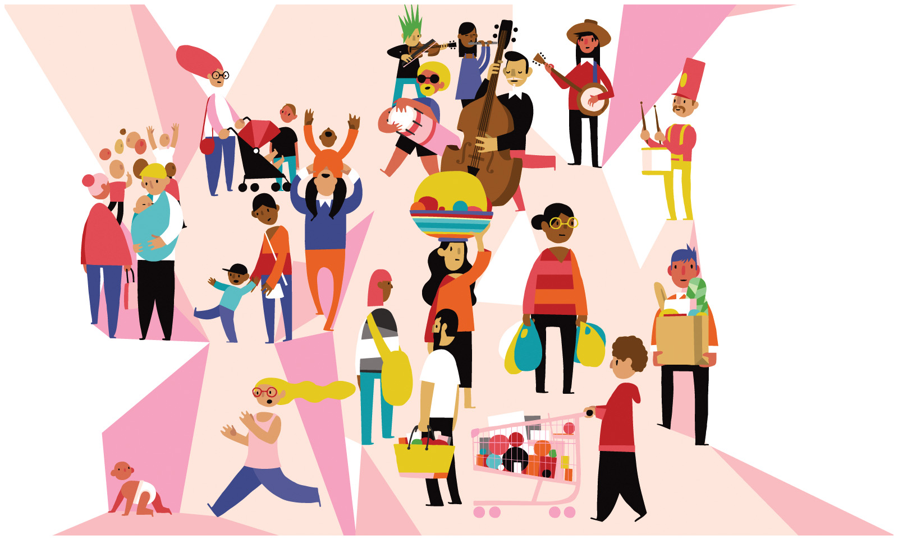

# Culture

This lesson introduces how sociologists think about culture. Culture is one of the fundamental elements of social life and, thus, an essential topic in sociology. Many of the concepts presented here will come up again in almost every subsequent lesson. Because culture is learned so slowly and incrementally, we are often unaware of how it becomes ingrained in our ways of thinking. Applying the sociological perspective to culture requires us to recognize the strangeness in our own culture. This lesson outlines the basics of studying culture and allows you to test potential relationships between television depictions of families and marriage rates. Although culture is familiar to us, you should be seeing it in a new and different way by the time you finish this lesson.


## Learning Objectives

```{admonition} By the end of this lesson, you will be able to:
* Describe how sociologists define the components of culture.
* Identify variation in culture and cultural change.  
* Analyze the relationship between culture and family.
```

## Read
* '[Culture](https://digital.wwnorton.com/87056)', Chapter 3 in Real World    


## Watch
* [Cultures, Subcultures, & Countercultures](https://www.youtube.com/watch?v=RV50AV7-Iwc)


<iframe
    width="400"
    height="300"
    src="https://www.youtube.com/embed/RV50AV7-Iwc"
    frameborder="0"
    allowfullscreen
></iframe>


* [Symbols, Values, & Norms](https://www.youtube.com/watch?v=kGrVhM_Gi8k)


<iframe
    width="400"
    height="300"
    src="https://www.youtube.com/embed/kGrVhM_Gi8k"
    frameborder="0"
    allowfullscreen
></iframe>


## Discuss (Thursday during class):

### Sould Food Junkies


> a culinary journey to understand a quintessential American cuisine: Soul Food. Filmmaker Byron Hurt examines the rich history and social significance of foods tied closely to black cultural identity as well as their health implications on the modern American diet. Join Hurt as he investigates the ups and downs of Soul Food and a growing food justice movement to make healthier foods more affordable and accessible. [PBS](http://www.pbs.org/black-culture/shows/list/soul-food-junkies/)


We will be applying our sociological tools to the film  [Sould Food Junkies](https://unc.kanopy.com/video/soul-food-junkies). We will watch it together starting Thursday during class.    
* Be sure to have the movie ready to roll at the start of class.
* Login to the course Slack at 9:45am and say hi to your group!

Before Thursday:
* What are some of your memories, feelings, or other associations with food?
* Is eating just a matter of personal behavior and preference? When do eating habits—or the effects of eating habits and food choices—step over into the public realm?


## Application: Families

This week you have your first application due. Many significant shifts have occurred over the last fifty years in how we think of the family and the experience of living in a household. These include changes in marital and living patterns, marriage and divorce rates, the gendered nature of housework, and labor force participation. There are many theories to explain the factors. In this application, you will focus on the **role of culture in creating new norms about the family.** Alternatively, culture may merely reflect other shifts i\n society. Is television responsible for the deinstitutionalization of the family? In this application, you will classify tv shows from four different decades to examine which changed first: changes in depictions of families on television or changes in families in society.

{doc}`Complete assignment description<../applications/families>`.

## Deadlines

```{admonition} Be sure to hand these in before the deadline   
* [Inquizitive Chapter 3](https://ncia.wwnorton.com/78597) (Thursday at 9:30am)
* {doc}`../applications/families` application (Sunday at 11:59pm)
* Soul Food Junkies reflection (Sunday at 11:59pm)

```

## Questions

```{admonition} Questions about assignments or the sociology of culture?
:class: tip
* Post it in the Slack #ask-the-prof channel!
* Ask your peers in the Slack #ask-anyone chanel!
* Signup for virtual office hours!
* Email me or your TA.
```

## Lesson Keywords

- ethnocentrism        
- cultural relativism   
- material culture     
- symbolic culture       
- Sapir-Whorf hypothesis
- values                 
- norms                
- laws                  
- folkways
- signs
- gestures
- language
- mores
- taboo
- sanction
- social control
- Dominant culture
- subculture
- counterculture
- ideal culture
- real culture
- cultural diffusion
- cultural imperialism
- sanction

## The least you need to know
Theoritical perspectives and culture


## Extra Resources

* [Overview of culture](https://youtu.be/Vo6W4kDv0cA) (Khan Academy)
* [Culture and society](https://youtu.be/QQsBM1dZLO4) (Khan Academy)
* [Subculture vs counterculture](https://youtu.be/4qoE3OVy4Vo) (Khan Academy)
* [Culture lag and culture shock](https://youtu.be/rm4pzNYDHAI) (Khan Academy)
* [Diffusion](https://youtu.be/W3_A_A0XBiY) (Khan Academy)
* [What is normal? Exploring folkways, mores, and taboos](https://youtu.be/tOEz6RC0aVo) (Khan Academy)


```python

```
