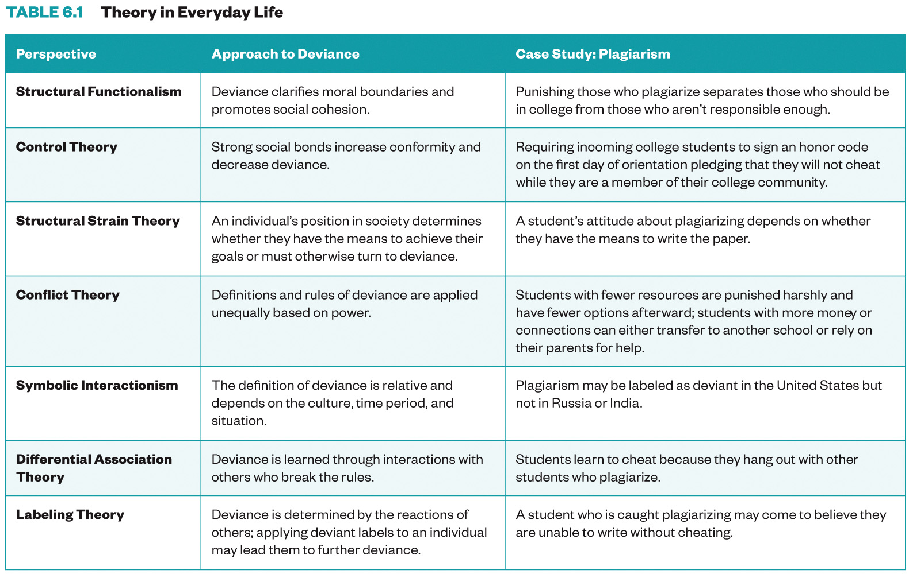

# Deviance

This lesson introduces the sociology of deviance and crime. In sociology, deviance isn't an insult.  Deviance means being non-normative: different Sociologists pay particular attention to the socially constructed nature of deviance and conformity, emphasizing how definitions of deviance vary across cultures, history, and situations.  This week, we will examine how the different theoretical perspectives approach deviance. Within sociology, crime is a particular type of deviance: It is the violation of a norm that has been codified into law, for which you could be arrested and imprisoned.  A sociological view of crime includes analyzing patterns through the lens of different demographic groups' power in society yields an interpretation of the data that differs from the mainstream understanding. The case study asks you to interpret findings from a study that looks at the relationship between imprisonment and being re-arrested.

## Learning Objectives

By the end of this lesson, you will be able to:
* Differentiate between competing theories of deviance.
* Describe trends in crime and incarceration.
* Evaluate the relationship between imprisonment and recidivism.

## Deadlines

```{admonition} Be sure to hand these in before the deadline   
* InQuizitive Chapter Set 6 (Thursday at 9:30am)
* Does imprisonment reduce violent crime? case study (Sunday at 11:55pm)
* Circle of Books reflection (Sunday at 11:55pm)

```

## Read
* '[Deviance](https://digital.wwnorton.com/87056/r/goto/cfi/92!/4)', Chapter 6 in Real World    


## Watch
* [Class Lecture](https://unc.zoom.us/j/96531859232) Live on Tuesday at 9:45am.
[](https://unc.zoom.us/j/96531859232)

* [Deviance](https://www.youtube.com/watch?v=BGq9zW9w3Fw)


<iframe
    width="400"
    height="300"
    src="https://www.youtube.com/embed/BGq9zW9w3Fw"
    frameborder="0"
    allowfullscreen
></iframe>


* [Theory and Deviance](https://www.youtube.com/watch?v=06IS_X7hWWI)


<iframe
    width="400"
    height="300"
    src="https://www.youtube.com/embed/06IS_X7hWWI"
    frameborder="0"
    allowfullscreen
></iframe>


* [Crime](https://www.youtube.com/watch?v=zBodqwAlW3A)


<iframe
    width="400"
    height="300"
    src="https://www.youtube.com/embed/zBodqwAlW3A"
    frameborder="0"
    allowfullscreen
></iframe>


## Discuss (Thursday during class):
### Circle of Books


> For over 35 years, the gay porn shop, Circus of Books, served as the epicenter for LGBT life and culture in Los Angeles. Unbeknownst to many in the community it served, the store was cultivated and cared for by its owners, Karen and Barry Mason; a straight couple with three children. CIRCUS OF BOOKS is an intimate portrait of the Masons and their journey to become one of the biggest distributors of hardcore gay porn in the United States. Their story unfolds through the lens of their daughter, filmmaker and artist, Rachel Mason. [rt](https://www.rottentomatoes.com/m/circus_of_books)


We will use the documentary film [Circus of Books](https://www.netflix.com/title/81011569) as an opportunity to explore how deviance is constructed and contested.  We will watch it together during class.    
* Be sure to have [the movie](https://www.netflix.com/title/81011569) ready to go at the start of class.
* Login to the course Slack by 9:45am and say hi to your group!


## Questions

```{admonition} If you have any questions at all about what you are supposed to do on this assignment, please remember I am here to help. Reach out any time so I can support your success.
:class: tip
* Post it in the Slack [#questions](https://soci101.slack.com/archives/C0177KHN1ML) channel!
* Signup for [virtual office hours](https://calendly.com/prof-caren/meeting)!
* [Email me](mailto:neal.caren@unc.edu) or your TA.
```


## Lesson Keywords

* deviance
* Merton’s typology of deviance
* social control theory
* differential association theory
* labeling theory
* primary deviance
* secondary deviance
* tertiary deviance
* stereotype threat
* stereotype promise
* stigma
* passing
* in-group orientation
* deviance avowal
* crime
* criminology
* uniform crime report
* Criminal Justice System
* retribution
* deterence
* rehabilitation
* positive deviance

## The least you need to know
Theoretical perspectives on deviance


