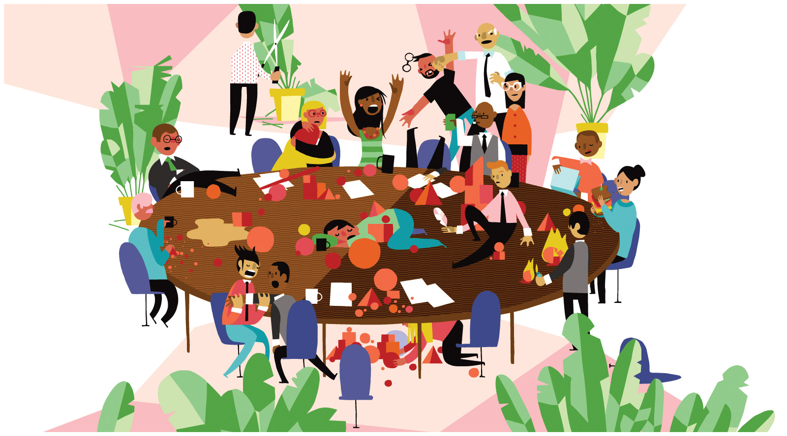
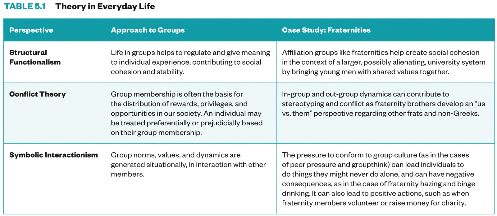

# Deviance

This lesson introduces the sociology of deviance and crime. In sociology, deviance isn't an insult.  Deviance means being non-normative: different Sociologists pay particular attention to the socially constructed nature of deviance and conformity, emphasizing how definitions of deviance vary across cultures, history, and situations.  This week, we will examine how the different theoretical perspectives approach deviance. Within sociology, crime is a particular type of deviance: It is the violation of a norm that has been codified into law, for which you could be arrested and imprisoned.  A sociological view of crime includes analyzing patterns through the lens of different demographic groups' power in society yields an interpretation of the data that differs from the mainstream understanding. The case study asks you to interpret findings from a study that looks at the relationship between imprisonment and being re-arrested.

## Learning Objectives

```{admonition} By the end of this lesson, you will be able to:
* Differentiate between competing theories of deviance.
* Describe trends in crime and incarceration.
* Evaluate the relationship between imprisonment and recidivism.
```

## Read
* '[Deviance](https://digital.wwnorton.com/87056/r/goto/cfi/92!/4)', Chapter 6 in Real World    


## Watch


* [Deviance](https://www.youtube.com/watch?v=BGq9zW9w3Fw)


<iframe
    width="400"
    height="300"
    src="https://www.youtube.com/embed/BGq9zW9w3Fw"
    frameborder="0"
    allowfullscreen
></iframe>


* [Theory and Deviance](https://www.youtube.com/watch?v=06IS_X7hWWI)


<iframe
    width="400"
    height="300"
    src="https://www.youtube.com/embed/06IS_X7hWWI"
    frameborder="0"
    allowfullscreen
></iframe>


* [Crime](https://www.youtube.com/watch?v=zBodqwAlW3A)


<iframe
    width="400"
    height="300"
    src="https://www.youtube.com/embed/zBodqwAlW3A"
    frameborder="0"
    allowfullscreen
></iframe>


## Discuss (Thursday during class):
### Racialized Relationships in Families and Communities


We will continue with the fourth episode of [American to Me](http://libproxy.lib.unc.edu/login?url=https://www-filmplatform-net.libproxy.lib.unc.edu/product/america-to-me).  We will watch it together starting Thursday at 9:50am.    
* Be sure to have the movie ready to roll at the start of class.
* Login to the course Slack at 9:45am and say hi to your group!

Before Thursday:
* How does race inform your sense of agency, the ability to feel empowered to take control of your own choices and actions, and advocate for yourself, around your racial identity?
* How does your sense of agency shift depending on who you are or who you are with?
* Where in your high school do you see agency around racial identity? Is it specific to only certain racial identities?


## Assignments

```{admonition} Be sure to hand these in before the deadline   
* Inquizitive Chapter Set 6 (Tuesday at 9:45am)
* Does imprisonment reduce violent crime? case study (Sunday at 11:59pm)
* America to Me Episode 3 reflection (Sunday at 11:59pm)

```

## Questions

```{admonition} Questions about assignments or the lesson?
:class: tip
* Post it in the Slack #ask-a-prof channel!
* Ask your peers in the Slack #ask-anyone chanel!
* Signup for virtual office hours!
* Email me or your TA.
```

## Lesson Keywords

* deviance
* Merton’s typology of deviance
* social control theory
* differential association theory
* labeling theory
* primary deviance
* secondary deviance
* tertiary deviance
* stereotype threat
* stereotype promise
* stigma
* passing
* in-group orientation
* deviance avowal
* crime
* criminology
* uniform crime report
* Criminal Justice System
* retribution
* deternce
* rehabilitation
* positive deviance

## The least you need to know
Theoretical perspectives on deviance


