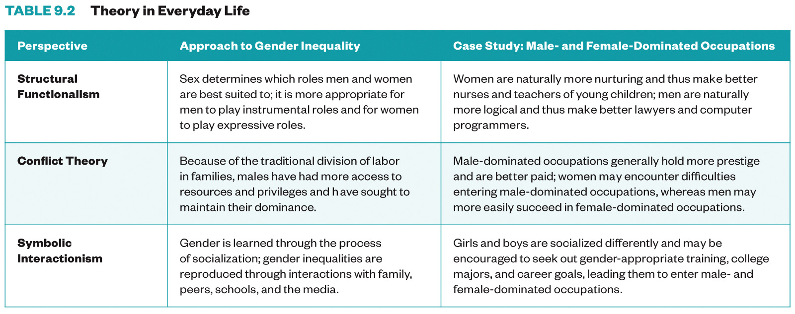

# Gender

This lesson focuses on the processes involved in constructing the meanings of genders and sexualities and the real consequences of gender and sexual inequality.  Gender and sexuality are often portrayed as part of our biological inheritance, unchanging, and unchangeable. Sociologists see sex, gender, sexual orientation, and trans identities are status categories that structure social inequality and shape individual identities. We all experience their overlap in our everyday lives. A sociological perspective allows us to see the cultural and environmental influences on what may be considered biologically based identities and lets us identify and critique the stratification systems that have resulted from these influences.

## Learning Objectives

By the end of this lesson, you will be able to:     
* Understand central concepts in the sociology of gender and sexuality and how major sociological perspectives view gender and sexuality.   
* Describe major sources of gender socialization and the impact of gender and sexuality on  life chances.    
* Apply appropriate research methods for cultural depictions of gender.        


## Deadlines

```{admonition} Be sure to hand these in before the deadline


* [InQuizitive Chapter Set 9](https://sakai.unc.edu/access/basiclti/site/3bab92f4-af18-42cb-bc83-86c9231667b2/efa9f5ff-20ce-4836-b60d-1b22ce9bce1a) (Thursday at 9:30am)
* [Bechdel Test application](https://soci101.org/applications/bechdel.html) (Sunday at 11:55pm)
* Strong Island reflection (Sunday at 11:55pm)

```

## Read
* '[Gender](https://ncia.wwnorton.com/87056)', Chapter 9 in Real World


## Watch
* [Class Lecture](https://unc.zoom.us/j/96531859232) Live on Tuesday at 9:45am.
[](https://unc.zoom.us/j/96531859232)


* [Sex & Sexuality](https://www.youtube.com/watch?v=Kqt-_ILgv5c)

<iframe
    width="400"
    height="300"
    src="https://www.youtube.com/embed/Kqt-_ILgv5c"
    frameborder="0"
    allowfullscreen
></iframe>


* [Gender Stratification](https://www.youtube.com/watch?v=Yb1_4FPtzrI)

<iframe
    width="400"
    height="300"
    src="https://www.youtube.com/embed/Yb1_4FPtzrI"
    frameborder="0"
    allowfullscreen
></iframe>


* [Theories of Gender](https://www.youtube.com/watch?v=CquRz_cceH8)

<iframe
    width="400"
    height="300"
    src="https://www.youtube.com/embed/CquRz_cceH8"
    frameborder="0"
    allowfullscreen
></iframe>


## Discuss (Thursday during class):
### Pushout: The Criminalization of Black Girls in Schools


> Inspired by the groundbreaking book of the same name by Monique W. Morris, Ed.D, PUSHOUT: THE CRIMINALIZATION OF BLACK GIRLS IN SCHOOLS, takes a deep dive into the lives of Black girls and the practices, cultural beliefs and policies that disrupts one of the most important factors in their lives - education. Alarmingly, African American girls are the fastest-growing population in the juvenile justice system and the only group of girls to disproportionately experience criminalization at every education level.

>  The film underscores the challenges Black girls face with insights from multiple experts across the country who have worked extensively in the fields of social and criminal justice, gender equality and educational equity, giving context to the crisis and providing a roadmap for how our educational system and those who interact with Black girls can provide a positive rather than punitive response to behaviors that are often misunderstood or misrepresented. [Official description](https://unc.kanopy.com/video/pushout-criminalization-black-girls-school-1)


We will use the documentary film [Pushout](https://unc.kanopy.com/video/pushout-criminalization-black-girls-school-1) as an opportunity to explore the sociology of gender.  We will watch it together during class.
* Be sure to have [the movie](https://unc.kanopy.com/video/pushout-criminalization-black-girls-school-1) ready to go at the start of class.
* We will start the movie at 9:45am promptly!


## Questions

```{admonition} If you have any questions at all about what you are supposed to do on this lesson, please remember I am here to help. Reach out any time so I can support your success.
:class: tip
* Post it in the Slack [#questions](https://soci101.slack.com/archives/C0177KHN1ML) channel!
* Signup for [virtual office hours](https://calendly.com/prof-caren/meeting)!
* [Email me](mailto:neal.caren@unc.edu) or your TA.
```


## Lesson Keywords

* sex
* gender
* essentialists
* constructionist
* gender binary
* gender identity
* cisgender & transgender
* gender expression
* sexual orientations or identities
* gender role socialization
* heteronormativity
* rape culture
*  institutions for gender socialization
*  microaggression
*  Gender, sexuality, and
life chances
* feminization of poverty


## The least you need to know
Theoretical perspectives on gender


